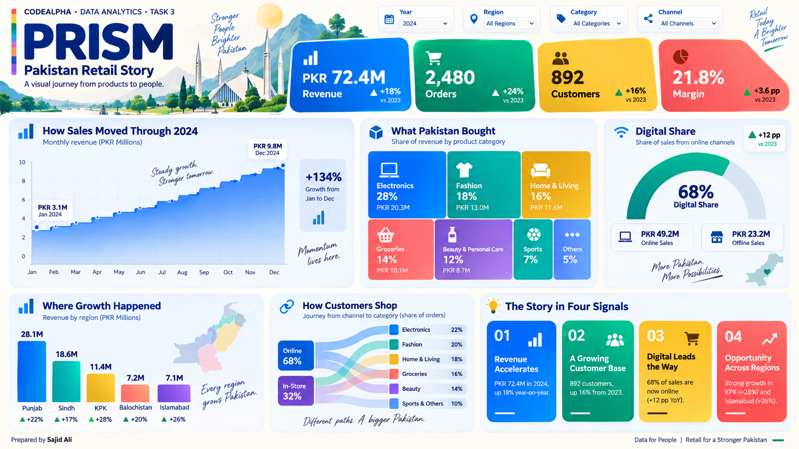

# PRISM — Pakistan Retail Story

**CodeAlpha Data Analytics Internship · Task 3: Data Visualization**  
Prepared by **Sajid Ali**

PRISM is a portfolio-ready, interactive retail storytelling dashboard. It transforms a reproducible synthetic transaction dataset into clear charts, responsive KPIs, filters, downloadable records, and decision-focused insights.

## Dashboard preview

<p align="center">
  <a href="./index.html">
    
  </a>
</p>

> After GitHub Pages is enabled, replace the link above with your published URL so the preview opens the live dashboard.

## How this matches CodeAlpha Task 3

| Guideline | Project evidence |
|---|---|
| Transform raw data into visual formats | Line/area, bar, doughnut gauge, category mosaic, customer journey and KPI cards |
| Use visualization tools | Python, Pandas, Matplotlib, Seaborn and Chart.js |
| Reveal insights clearly | Interactive Year, Region, Category and Channel filters update every visual |
| Craft a compelling data story | “The Story in Four Signals” converts the selected data into decision-ready findings |
| Build a strong portfolio | Responsive professional dashboard, static analytical report, README and GitHub Pages support |

## Open the dashboard

No installation is needed for the included dashboard:

1. Download and extract the project.
2. Open `index.html` directly, or double-click `OPEN_DASHBOARD.bat` on Windows.
3. Change the filters and press **Download CSV** to export the current selection.

The dashboard is fully self-contained and also works on GitHub Pages. `RUN_ANALYSIS.bat` is optional; it only regenerates the dataset, Python charts and embedded dashboard data.

## Regenerate the analysis

Python 3.9+ is recommended.

```bash
python -m pip install -r requirements.txt
python generate_dataset.py
python visualize.py
python build_dashboard.py
```

Generated outputs are saved in `output/`. The interactive dashboard continues to open from root `index.html`.

## Project structure

```text
Task_3_Data_Visualization/
├── index.html                  # GitHub Pages and local entry point
├── dashboard/                 # Styles, JavaScript, embedded data and preview
├── data/                      # Analysis-ready CSV dataset
├── output/                    # Matplotlib/Seaborn visualizations
├── generate_dataset.py        # Reproducible data generator
├── visualize.py               # Python visualization workflow
├── build_dashboard.py         # Builds offline dashboard data
├── OPEN_DASHBOARD.bat         # Optional quick open
├── RUN_ANALYSIS.bat           # Optional full regeneration
└── requirements.txt
```

## Dataset and responsible use

The project uses a **synthetic Pakistan retail dataset** created with a fixed random seed for learning and portfolio demonstration. It is not official Pakistan data and must not be presented as real business or government statistics. The data includes 4,480 orders across 2023–2024, with dates, customers, regions, categories, channels, payment methods, quantities, revenue, costs, profit and return status.

## GitHub Pages

Upload the complete folder contents to your repository. In GitHub, open **Settings → Pages**, choose **Deploy from a branch**, select `main` and `/(root)`, then save. Because the dashboard entry point is root `index.html`, **Visit site opens the dashboard directly** rather than the README.

Suggested CodeAlpha master repository: `codealpha_tasks`, with this project inside `Task_3_Data_Visualization/`.

## License

MIT License. See [LICENSE](LICENSE).
